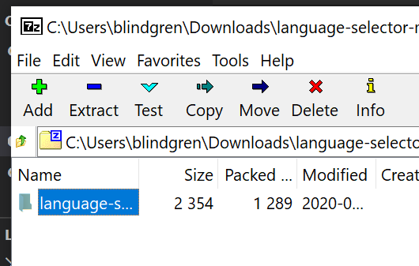
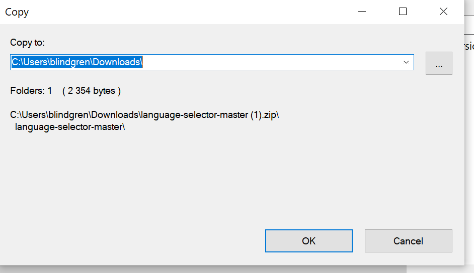

# Movie Tickets

#### Object Oriented Programming practice for Epicodus, 06.16.2020

## By Brittany Lindgren & Micheal Hansen

## Description

Purchase movie tickets easily online!

## Setup/Installation Requirements

1. Follow this [link to the project repository](GITHUB REPO LINK HERE) on GitHub.

2. Click on the "Clone or download" button to copy the project link.
 

3. If you are comfortable with the command line, you can copy the project link and clone it through your commad line with the command `git clone`. Otherwise, I recommend choosing "**Download ZIP**". 

4. Once the ZIP file has finished downloading, you can right click on the file to view the zip folder in your downloads. 

5. Right click on the project ZIP folder that you have just downloaded and choose the option "**Copy To...**", then choose the location where you would like to save this folder. 

6. Navigate to the final location where you have chosen to save the project folder.

7. To view the code itself, right click, choose "open with..." and open using a text editor such as VS Code or Atom, etc.

#### Additional Setup/Installation Notes:

* You do not need a server or any additional code to view this project

## Specifications

#### Behavior: Program creates a Ticket object with a default price when the user submits
* Input: User clicks submit
* Output: {Price: 13}

#### Behavior: Program attaches movie name to the Ticket object
* Input: Name= "Star Wars"
* Output: {Name: Star Wars, Price: 13}

#### Behavior: Program reduces default price if user selects 'Matinee'
* Input: 'Matinee'
* Output: {Name Star Wars, Price: 10}

#### Behavior: Program reduces default price if user is a Youth or Senior
* Input: Age = 9
* Output: {Name Star Wars, Price: 10}

#### Behavior: Program reduces default price if user is a Student or Veteran, unless the age discount applies
* Input: 'Student'
* Output: {Name Star Wars, Price: 12}

#### Behavior: Program gathers inputs and applies the rules as appropriate
* Input: 'Matinee 15 Student'
* Output: {Name Star Wars, Price: 8}

## Known Bugs

#### Not Yet Resolved
* There are no known bugs at this time
#### Resolved
* 

## User Interface, To Resolve
#### Not Yet Resolved (on Styling Branch)
* n/a
#### Resolved
* n/a

## Support and contact details

Please feel free to contact me through GitHub (username: LINDGRENBA) with any questions, ideas or concerns.  

## Technologies Used

* HTML5
* CSS3
* Bootstrap v-3.3.7
* JavaScript
* jQuery v-3.5.0
* Visual Studio Code 
* Git and Git BASH 

### License

*This site is licensed under the MIT license.*

Copyright (c) YEAR **_Brittany Lindgren & Micheal Hansen_**